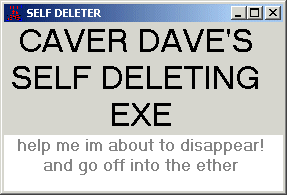



## Self \- Deleting EXE v 1\.0\.0

### Description

Title: Self - Deleting EXE v 1.0.0

This is the result of a my curiosity and a very ignominoius thread that I started in the vb.general.discussion newsgroup

Thread address is:-

http://msdn.microsoft.com/newsgroups/default.aspx?dg=microsoft.public.vb.general.discussion&amp;tid=d143570e-ad49-4ae5-bebd-2a53faeb7eeb&amp;cat=&amp;lang=en&amp;cr=US&amp;sloc=en-us&amp;p=1

Any way this is the result in pure vb that does something and then creates a batch file to delete the exe.

Lump it or loathe it I did not write this for any malign purposes, so respect that!

Bend it break it use it as you like but:-

If you like this code please vote for it

dave
 
### More Info
 
some DOS

deletes itself

possible computer hanging

             |
---                |---
**Submitted On**   |2007-05-14 00:08:56
**By**             |[caver dave](https://github.com/Planet-Source-Code/PSCIndex/blob/master/ByAuthor/caver-dave.md)
**Level**          |Intermediate
**User Rating**    |4.8 (19 globes from 4 users)
**Compatibility**  |VB 6\.0
**Category**       |[Miscellaneous](https://github.com/Planet-Source-Code/PSCIndex/blob/master/ByCategory/miscellaneous__1-1.md)
**World**          |[Visual Basic](https://github.com/Planet-Source-Code/PSCIndex/blob/master/ByWorld/visual-basic.md)
**Archive File**   |[Self\_\-\_Del2066475192007\.zip](https://github.com/Planet-Source-Code/caver-dave-self-deleting-exe-v-1-0-0__1-68631/archive/master.zip)

